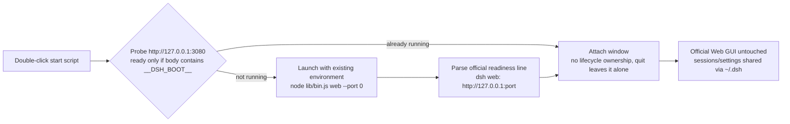

<!-- English | [简体中文](README.md) -->

<div align="center">


# dsh-shell

**One click turns your already-installed [DeepSeek Harness](https://github.com/deepseek-ai/deepseek-harness) into a desktop window**

*Zero new environment · Zero core changes · Sessions and settings carried over as-is*

[](LICENSE)
[]()
[]()
[](https://github.com/deepseek-ai/deepseek-harness)
[](CONTRIBUTING.md)

[简体中文](README.md) · [Why](#why) · [Quick Start](#quick-start) · [How It Works](#how-it-works) · [FAQ](#faq)

</div>

---

## Why

The official flow is `dsh web` in a terminal, then a browser tab. If your harness is already installed, you just want two fewer steps:

| Pain | dsh-shell's answer |
|---|---|
| Opening a terminal, typing commands, copying a URL | **Double-click once — the window appears** |
| Forgetting whether the harness is running | Auto-detect: attach if running, launch it for you if not |
| Losing the tab among dozens | Dedicated desktop window + tray (Electron build) |
| Port conflicts / white screens from "HTTP 200" false readiness | `--port 0` auto-assigns a port; readiness is judged by the official URL line |

**What it is not**: not a UI clone, not a distribution, no bundled runtime. The window renders 100% of the official Web GUI — the shell's entire job lives outside the window.

## Quick Start

**Zero-install (try this first)**: double-click `启动Harness桌面.cmd`. Done.

```
start-shell.cmd ──▶ auto-detect / auto-launch harness ──▶ standalone desktop window (Edge app-mode)
```

**Full build (tray / status window / logs / retry)**:

```powershell
cd dsh-shell
npm install   # npmmirror mirror preconfigured (fixes Electron binary download failures)
npm start     # or double-click start-electron.cmd
```

## How It Works



Two rules:

1. **Readiness** is only the official `dsh web: http://…` line — never "HTTP 200" (prevents white screens).
2. **Zero injection**: the main window loads the official page untouched; the shell's preload only reaches its own status window.

## Two Modes

| | 🚀 Edge zero-install | 🖥️ Electron full build |
|---|---|---|
| Install | **None** | npm install (one-time) |
| Window | Edge app-mode standalone window (dedicated profile) | Native window + bounds memory |
| Tray | - | Show/hide, restart, open logs |
| Status window | - | Startup progress / errors / logs / retry |
| Best for | Quick try, zero barrier | Daily driver |

## vs. Bundled Distributions

All-in-one packages (anywhere-labs, xiincs, etc.) bundle Node and dependencies for **new users** who never installed the harness. dsh-shell takes the other road:

| | dsh-shell | Bundled distributions |
|---|---|---|
| Audience | Users with an installed harness | Fresh users |
| New environment | **Zero** | Ships Node + deps |
| Harness changes | **Zero** | Often ships integration plugins |
| Data | Shares `~/.dsh` with the CLI | Usually a separate data dir |
| Footprint / maintenance | Minimal | Full product |

## Screenshots

<!-- After uploading, uncomment below (images under assets/screenshots/):
| Status window | Main window |
|---|---|
|  |  |
-->

> TODO: press `Win+Shift+S` with the shell running, upload the two shots to `assets/screenshots/` via *Add file → Upload files*, then uncomment the block above.

## Configuration

First run generates `%APPDATA%\dsh-shell\dsh-shell.json` (Electron build; defaults in `src/config.js`):

| Key | Default | Meaning |
|---|---|---|
| `harnessCheckout` | `D:\workspace\deepseek-harness` | Checkout path used for launching |
| `attachUrl` | `http://127.0.0.1:3080` | Probe address for attach mode |
| `spawnMode` | `auto` | `tsx` (source) / `built` (compiled) / `auto` (fallback) |
| `dshHome` | `''` | Empty = inherit env (default `~/.dsh`); or an explicit path |
| `spawnArgs` | `[]` | Extra args for `dsh web` (already includes `--port 0`) |

## Roadmap

- [x] Attach / launch / Edge zero-install / Electron shell + tray
- [ ] electron-builder packaging: NSIS installer + portable build + icons
- [ ] Tray shows running job / goal state
- [ ] Auto-start on boot, `dsh://` deep links
- [ ] Desktop notifications (via the official plugin system, not the core)
- [ ] macOS / Linux support

## FAQ

- **Conflict with my terminal `dsh web`?** No — the shell probes first and attaches to the same instance; it never starts a duplicate or races the same config.
- **Where is my data?** `~/.dsh` (or your `DSH_HOME`) — the same sessions the CLI uses.
- **How to stop a shell-launched instance?** Electron: quit the app. Edge: `.\launcher\start-shell-edge.ps1 -Stop`.
- **Does the shell download anything?** No — the only exception is the one-time `npm install electron` (npmmirror preconfigured).

## Structure

```
dsh-shell/
├─ 启动Harness桌面.cmd         Zero-install double-click (Edge app-mode)
├─ start-electron.cmd          Electron double-click launcher
├─ src/                        Electron main process
│  ├─ main.js                  Window / tray / menu / lifecycle
│  ├─ host-manager.js          The only shell↔harness bridge: attach / spawn / readiness / logs
│  ├─ config.js                Config I/O
│  └─ preload.js               Only reaches the shell's own status window
├─ ui/status.html              Startup status / errors / logs
├─ launcher/start-shell-edge.ps1   Edge-mode core logic
└─ assets/                     Icons
```

## Contributing

Issues and PRs of any kind are welcome — see [CONTRIBUTING.md](CONTRIBUTING.md). One boundary: **no harness-core changes** (upstream work belongs to [deepseek-ai/deepseek-harness](https://github.com/deepseek-ai/deepseek-harness)).

## Star History

[](https://www.star-history.com/#TaoSmile/dsh-shell&Date)

## License

MIT, matching upstream [deepseek-ai/deepseek-harness](https://github.com/deepseek-ai/deepseek-harness) (MIT).

---

<div align="center">

If it saves you a few steps, leave a ⭐ on your way out～

</div>
