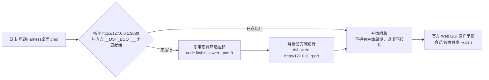
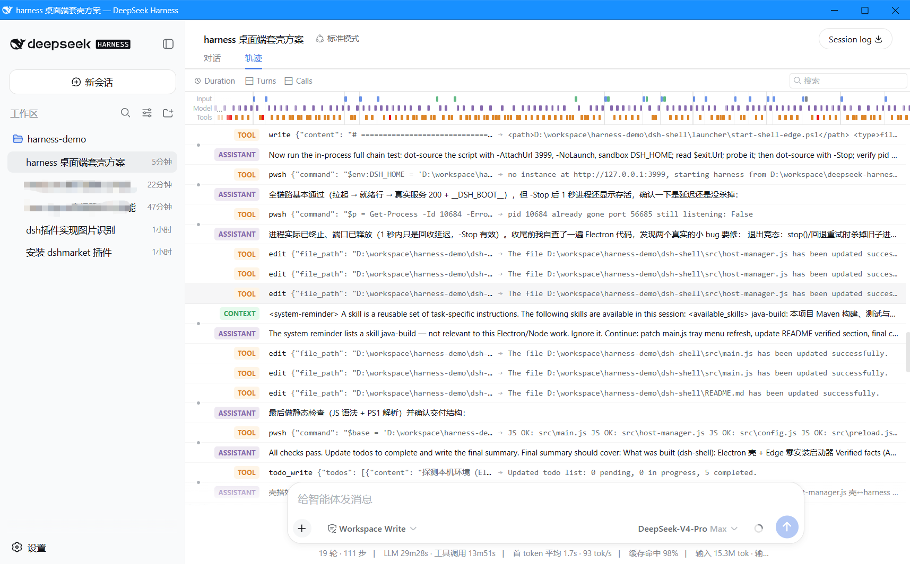

<!-- 简体中文 | [English](README.en.md) -->

<div align="center">


# dsh-shell

**一个动作，把已经装好的 [DeepSeek Harness](https://github.com/deepseek-ai/deepseek-harness) 装进桌面窗口**

*零新环境 · 零核心改动 · 会话与设置原样继承*

[](LICENSE)
[]()
[]()
[](https://github.com/deepseek-ai/deepseek-harness)
[](CONTRIBUTING.md)

[English](README.en.md) · [为什么需要它](#为什么需要它) · [快速开始](#快速开始) · [工作原理](#工作原理) · [常见问题](#常见问题)

</div>

---

## 为什么需要它

官方姿势是在终端里跑 `dsh web` 再开浏览器。对已经装好 harness 的你来说，只是想少两步：

| 痛点 | dsh-shell 的答案 |
|---|---|
| 每次开终端、敲命令、复制 URL | **双击一次，窗口自己弹出来** |
| 忘记 harness 有没有在跑 | 自动探测：在跑就包住它，没跑就替你拉起来 |
| 标签页里找不到、被淹没 | 独立桌面窗口 + 托盘常驻（Electron 版） |
| 端口冲突 / "HTTP 200"假就绪白屏 | `--port 0` 自动分配端口；就绪以官方 URL 行为准 |

**它不是什么**：不是仿制 UI、不是发行版、不打包运行时。窗口里 100% 是官方 Web GUI——壳的全部工作都在窗口之外。

## 快速开始

**零安装版（推荐先试）**：双击 `启动Harness桌面.cmd`，完。

```
启动Harness桌面.cmd ──▶ 自动探测/拉起 harness ──▶ 独立桌面窗口（Edge app-mode）
```

**完整版（托盘 / 状态窗 / 日志 / 重试）**：

```powershell
cd dsh-shell
npm install   # 已内置 npmmirror 镜像，解决 Electron 二进制下载失败
npm start     # 或双击 start-electron.cmd
```

## 工作原理



两条铁律：

1. **就绪判定**只认 harness 官方就绪行 `dsh web: http://…`，绝不把"HTTP 200"当就绪（防止白屏）。
2. **零注入**：主窗口加载官方页面原样，壳的 preload 只注入自己的状态小窗。

## 两种模式对比

| | 🚀 Edge 零安装版 | 🖥️ Electron 完整版 |
|---|---|---|
| 安装 | **无** | npm install（一次性） |
| 窗口 | Edge app-mode 独立窗口（专用 profile） | 原生窗口 + 尺寸记忆 |
| 托盘 | - | 显示/隐藏、重启、打开日志 |
| 状态小窗 | - | 启动进度 / 错误 / 日志 / 重试 |
| 适合 | 快速体验、零门槛 | 日常主力 |

## 和其他桌面端有什么不同

社区已有一体化打包（如 anywhere-labs、xiincs 等）：它们内置 Node/依赖，给**没装过 harness** 的新用户开箱即用。dsh-shell 走另一条路：

| | dsh-shell | 一体化打包 |
|---|---|---|
| 面向 | 已经装好 harness 的用户 | 全新用户 |
| 新增环境 | **零** | 自带 Node + 依赖 |
| harness 改动 | **零** | 常附带集成插件 |
| 数据 | 与命令行共享 `~/.dsh` | 通常独立数据目录 |
| 体积/维护面 | 最小 | 完整产品 |

## 预览

<!-- 截图上传后取消下面注释（图片放 assets/screenshots/）：
| 启动状态窗 | 主窗口 |
|---|---|
|  |  |
-->

> 截图待补充：跑起来后按 `Win+Shift+S` 截两张（启动状态窗 + 主窗口），在 GitHub 仓库页 `assets/` → *Add file → Upload files* 拖入 `screenshots/` 目录，再取消上面的注释即可。

## 配置

首次运行自动生成 `%APPDATA%\dsh-shell\dsh-shell.json`（Electron 版；默认值见 `src/config.js`）：

| 键 | 默认 | 说明 |
|---|---|---|
| `harnessCheckout` | `D:\workspace\deepseek-harness` | A1 拉起使用的 checkout 路径 |
| `attachUrl` | `http://127.0.0.1:3080` | A0 附着探测地址 |
| `spawnMode` | `auto` | `tsx`（源码）/ `built`（构建产物）/ `auto`（失败自动回退） |
| `dshHome` | `''` | 空 = 继承环境（默认 `~/.dsh`）；可显式指定 |
| `spawnArgs` | `[]` | 追加给 `dsh web` 的参数（默认已有 `--port 0`） |

## Roadmap

- [x] A0 附着 / A1 拉起 / Edge 零安装版 / Electron 壳 + 托盘
- [ ] electron-builder 打包：NSIS 安装包 + 便携版 + 图标
- [ ] 托盘显示运行中的 job / goal 状态
- [ ] 开机自启、`dsh://` 深链
- [ ] 桌面通知（走 harness 官方插件体系，不进核心）
- [ ] macOS / Linux 适配

## 常见问题

- **会和我终端里跑的 `dsh web` 冲突吗？** 不会。壳先探测，命中就附着同一个实例，不会起第二份、不会抢写同一份配置。
- **数据在哪？** 沿用 `~/.dsh`（或你设置的 `DSH_HOME`），与命令行共享同一份会话。
- **怎么停止壳拉起的实例？** Electron 版退出即停；Edge 版运行 `.\launcher\start-shell-edge.ps1 -Stop`。
- **壳会联网下载东西吗？** 不会。唯一例外是首次 `npm install electron`（已内置 npmmirror 镜像）。

## 目录结构

```
dsh-shell/
├─ 启动Harness桌面.cmd         零安装双击启动（Edge app-mode）
├─ start-electron.cmd          Electron 版双击启动
├─ src/                        Electron 主进程
│  ├─ main.js                  窗口 / 托盘 / 菜单 / 生命周期
│  ├─ host-manager.js          壳↔harness 唯一桥：attach / spawn / 就绪解析 / 日志
│  ├─ config.js                配置读写
│  └─ preload.js               仅注入壳自己的状态小窗
├─ ui/status.html              启动状态 / 错误 / 日志
├─ launcher/start-shell-edge.ps1   Edge 版核心逻辑
└─ assets/                     图标
```

## 参与贡献

任何形式的 issue / PR 都欢迎，见 [CONTRIBUTING.md](CONTRIBUTING.md)。边界只有一条：**不改 harness 核心**（对上游的改动请直接提给 [deepseek-ai/deepseek-harness](https://github.com/deepseek-ai/deepseek-harness)）。

## Star 历史

[](https://www.star-history.com/#TaoSmile/dsh-shell&Date)

## 许可

MIT，与上游 [deepseek-ai/deepseek-harness](https://github.com/deepseek-ai/deepseek-harness)（MIT）保持一致。

---

<div align="center">

如果它帮你省了几步，点个 ⭐ 再走～

</div>
